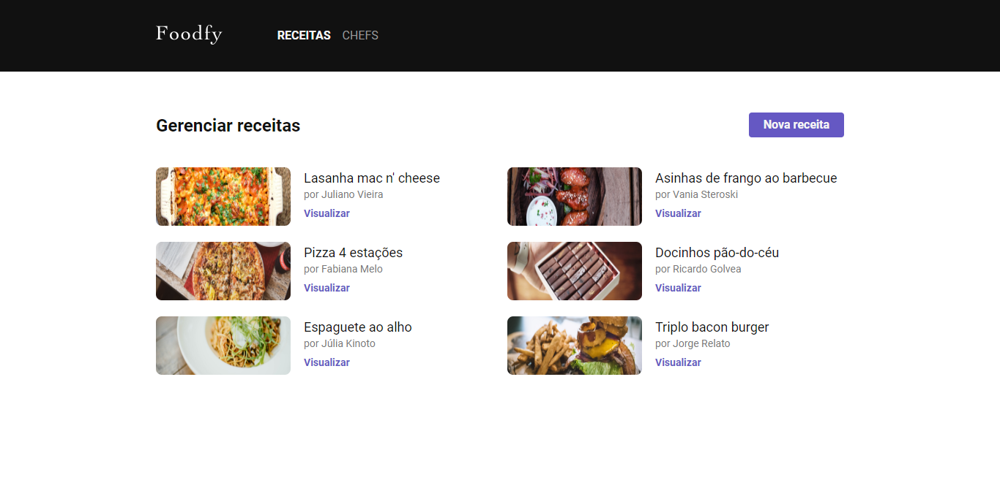

# Foodfy

<p>Aprenda a construir os melhores pratos com receitas criadas por profissionais do mundo inteiro.</p>

<p>
  
  
  <a href="https://opensource.org/licenses/MIT">
    
  </a>
  <a href="https://github.com/martins-rafael/foodfy/commits/master">
    
  </a>
    
</p>


## Tópicos 

[Sobre o Foodfy](#sobre-o-foodfy)

[Funcionalidades](#funcionalidades)

[Tecnologias](#tecnologias)

[Instalação e uso](#instalação-e-uso)

[Licença](#licença)

<br>

## Sobre o Foodfy

O Foodfy é uma aplicação web completa de gerenciamento de receitas, desenvolvida durante o bootcamp [LaunchBase](https://rocketseat.com.br/launchbase) da [Rocketseat](https://rocketseat.com.br/).

### Main
<p align="center">
  
</p>

<br>

### Admin
<p align="center">
  
  
</p>

<br>

## Funcionalidades

- [X] Explore variados tipos de receitas.
- [X] Criar, visualizar, editar e apagar receitas e chefs.
- [X] Pesquisar receitas.
- [X] Páginas dinâmicas com Nunjucks.
- [X] Banco de dados PostgreSQL.

<br>

## Tecnologias

As seguintes tecnologias foram utilizadas no desenvolvimento do projeto:

- [HTML](https://devdocs.io/html/)
- [CSS](https://devdocs.io/css/)
- [Javascript](https://devdocs.io/javascript/)
- [Node](https://nodejs.org/en/)
- [Express](https://expressjs.com/)
- [Nunjucks](https://mozilla.github.io/nunjucks/)
- [PostgreSQL](https://www.postgresql.org/)

<br>

## Instalação e uso

Para rodar a aplicação, você precisa instalar o [Node](https://nodejs.org/en/) e o [Postgres](https://www.postgresql.org/).

Siga os passos abaixo:

1) Abra um terminal e copie este repositório com o comando
    ```
    git clone https://github.com/martins-rafael/foodfy.git
    ```
    ou use a opção de download.

<br>

2) Entre na pasta com 
    ```
    cd foodfy
    ```

<br>

3) Instale as dependências
    ```
    npm install
    ```

<br>

4) Crie e importe o banco de dados
    ```
    psql -U postgres -c "CREATE DATABASE foodfy"
    psql -U postgres -d foodfy <foodfy.sql
    ```
    Você também pode criar e importar manualmente o banco de dados usando o Postbird ou pgAdmin.
    
<br>

5) Para configurar a conexão com o banco de dados, abra e edite o arquivo ```db.js``` dentro da pasta ```src/config``` com o seu user e password do Postgres.
    
    <br>

6) Rode a aplicação
    ```
    npm start
    ```

<br>

## Licença

Esse projeto está sob a licença MIT. Veja o arquivo [LICENSE](/LICENSE) para mais detalhes.

---

Feito com :purple_heart: by [Rafael Martins](https://github.com/martins-rafael)
