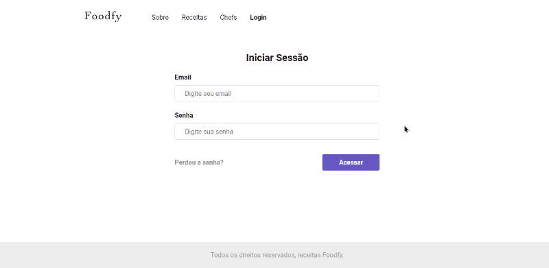

# Foodfy

<p>Aprenda a construir os melhores pratos com receitas criadas por profissionais do mundo inteiro.</p>

<p>
  
  
  <a href="https://opensource.org/licenses/MIT">
    
  </a>
  <a href="https://github.com/martins-rafael/foodfy/commits/master">
    
  </a>
    
</p>


## Tópicos 

- [Sobre o Foodfy](#sobre-o-foodfy)
- [Funcionalidades](#funcionalidades)
- [Tecnologias](#tecnologias)
- [Instalação e uso](#instalação-e-uso)
- [Licença](#licença)

<br>

## Sobre o Foodfy

O Foodfy é uma aplicação web completa de gerenciamento de receitas, desenvolvida durante o bootcamp Launchbase da [Rocketseat](https://rocketseat.com.br/).

<p align="center">
  
</p>

<p align="center">
  
</p>

<br>

## Funcionalidades

Explore variados tipos de receitas.

Crie, visualize, edite e apague receitas.

<br>

## Tecnologias

As seguintes tecnologias foram utilizadas do desenvolvimento do projeto

- [HTML](https://devdocs.io/html/)
- [CSS](https://devdocs.io/css/)
- [Javascript](https://devdocs.io/javascript/)
- [Node](https://nodejs.org/en/)
- [Express](https://expressjs.com/)
- [Nunjucks](https://mozilla.github.io/nunjucks/)

<br>

## Instalação e uso

Para rodar a aplicação, você precisa ter o [Node](https://nodejs.org/en/) instalado em sua máquina e seguir os passos abaixo:

1) Abra um terminal e copie este repositório com 
    ```
    git clone https://github.com/martins-rafael/foodfy.git
    ```
    ou use a opção de download.

2) Entre na pasta com 
    ```
    cd foodfy
    ```

3) Instale as dependências
    ```
    npm install
    ```

4) Rode a aplicação
    ```
    npm start
    ```

<br>

## Licença

Esse projeto está sob a licença MIT. Veja o arquivo [LICENSE](/LICENSE) para mais detalhes.

---

Feito com :purple_heart: by [Rafael Martins](https://github.com/martins-rafael)
