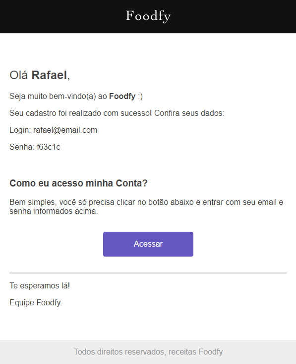

# Foodfy

<p>Aprenda a construir os melhores pratos com receitas criadas por profissionais do mundo inteiro.</p>

<p>
  
  
  <a href="https://opensource.org/licenses/MIT">
    
  </a>
  <a href="https://github.com/martins-rafael/foodfy/commits/master">
    
  </a>
    
</p>


## Tópicos 

[Sobre o Foodfy](#sobre-o-foodfy)

[Funcionalidades](#funcionalidades-e-ferramentas)

[Tecnologias](#tecnologias)

[Instalação e uso](#instalação-e-uso)

[Licença](#licença)

<br>

## Sobre o Foodfy

O Foodfy é uma aplicação web completa de gerenciamento de receitas, desenvolvida durante o bootcamp [LaunchBase](https://rocketseat.com.br/launchbase) da [Rocketseat](https://rocketseat.com.br/).

### Main
<p align="center">
  
</p>

<br>

### Admin
<p align="center">
  
</p>

<br>

### Email de boas-vindas
<p align="center">
  
</p>

<br>

## Funcionalidades

- [X] Explore variados tipos de receitas.
- [X] Gerencie receitas, chefs e usuários.
- [X] Upload de imagems com Multer.
- [X] Pesquisar receitas.
- [X] Páginas dinâmicas com Nunjucks.
- [X] Banco de dados PostgreSQL.
- [X] Sistema de login e recuperação de senha.
- [X] Área administrativa.

<br>

## Tecnologias e Ferramentas

As seguintes tecnologias foram utilizadas no desenvolvimento do projeto:

- [HTML](https://devdocs.io/html/)
- [CSS](https://devdocs.io/css/)
- [JavaScript](https://devdocs.io/javascript/)
- [Nunjucks](https://mozilla.github.io/nunjucks/)
- [NodeJS](https://nodejs.org/en/)
- [Nodemailer](https://nodemailer.com/about/)
- [Express](https://expressjs.com/)
- [Express Session](https://github.com/expressjs/session)
- [PostgreSQL](https://www.postgresql.org/)
- [BcryptJS](https://github.com/dcodeIO/bcrypt.js)
- [Faker.js](https://github.com/Marak/Faker.js)

<br>

## Instalação e Uso

Para rodar a aplicação, você precisa instalar o [Node](https://nodejs.org/en/) e o banco de dados [Postgres](https://www.postgresql.org/).

Siga os passos abaixo:

```bash
# Abra um terminal e copie este repositório com o comando
$ git clone https://github.com/martins-rafael/foodfy.git
# ou use a opção de download.

# Entre na pasta com 
$ cd foodfy

# Instale as dependências
$ npm install

# Crie o banco de dados e as tabelas utilizando os comandos inclusos no arquivo "foodfy.sql".
    
# Conexão com o banco de dados:
# Abra e edite o arquivo "db.js" dentro da pasta "src/config" com o seu user e password do Postgres.

# Popule o banco de dados usando o aquivo "seed.js":
$ node seed.js

# Rode a aplicação
$ npm start
```

**Importante:** Não exclua ou altere as imagens de placeholder diretamente da pasta `plublic/images`, pois as receitas e chefs gerados pelo `seed.js` compartilham desses arquivos entre si. Porém, é seguro deletá-las pela área administrativa do site.

<br>

### Acessando a Área Administrativa

Utilizando um email da tabela users, acesse a tela de login e entre com o mesmo e com a senha "rocket" (senha padrão).

Dica: usuários administradores possuem a badge "ADMIN" no header:
<p align="center">
  
</p>

<br>

### Criando Novos Usuários e Recupeção de Senha

Para usar estes recursos, edite o arquivo `mailer.js` dentro da pasta `scr/lib` com suas credenciais.

<br>

## Licença
<a href="https://opensource.org/licenses/MIT">
    
</a>

<br>

Esse projeto está sob a licença MIT. Veja o arquivo [LICENSE](/LICENSE) para mais detalhes.

---

Feito com :purple_heart: by [Rafael Martins](https://github.com/martins-rafael)

[](https://www.linkedin.com/in/rafaeldcmartins/) 
[](mailto:rafaeldcmartins@gmail.com)
